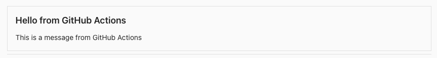
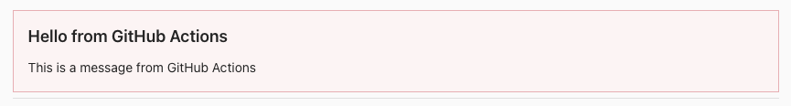
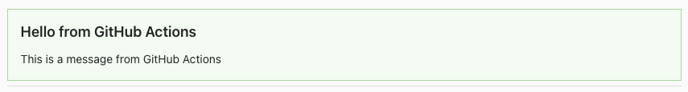

<!-- markdownlint-disable first-line-heading -->


# About

GitHub Action to post to Microsoft Teams Workflows using a Adaptive Card.

Starting October 2024 Microsoft [Retired](https://devblogs.microsoft.com/microsoft365dev/retirement-of-office-365-connectors-within-microsoft-teams/) the `incoming webhook` functionality on Channels.

With this Retirement Microsoft offered a new method using [Workflows](https://prod.support.services.microsoft.com/en-us/office/create-incoming-webhooks-with-workflows-for-microsoft-teams-8ae491c7-0394-4861-ba59-055e33f75498), this action supports posting to Teams with the workflow method.

## Features

- Post simple Title/Message Card
- Control simple card style (good, attention, warning, ...)
- Post Card from RAW input

## Design Card

[https://adaptivecards.microsoft.com/designer.html](https://adaptivecards.microsoft.com/designer.html)

## Usage

| with parameter  | required/optional                    | default | description                                               |
| --------------- | ------------------------------------ | ------- | --------------------------------------------------------- |
| valid_responses | false                                | 200,202 | Valid responses from the Teams workflow (comma-separated) |
| raw             | false                                |         | Raw Adaptive Card JSON                                    |
| message         | false \| **true** when NOT using raw |         | Message to post to Teams                                  |
| title           | false \| **true** when NOT using raw |         | Title of the message                                      |
| style           | false                                | default | Style of the message                                      |
| webhook_url     | true                                 |         | Webhook URL for the Teams channel                         |
| payload         | false                                | false   | Print the payload                                         |

Please refer [action.yml](./action.yml) for more details.

## Examples

gith

```yml
on: [push]

jobs:
  simple:
    runs-on: ubuntu-latest
    name: Simple Post
    steps:
      - uses: actions/checkout@v4
      - name: Post to Microsoft Teams
        uses: ./
        id: post-to-teams
        with:
          title: "Hello from GitHub Actions"
          message: "This is a message from GitHub Actions"
          webhook_url: "http://prod-......com"
      - name: Get the response
        run: echo "${{ steps.post-to-teams.outputs.response }} ${{ steps.post-to-teams.outputs.message }}"
  simple-good:
    runs-on: ubuntu-latest
    name: Simple Successful Post
    steps:
      - uses: actions/checkout@v4
      - name: Post to Microsoft Teams
        uses: ./
        id: post-to-teams
        with:
          title: "Hello from GitHub Actions"
          message: "This is a message from GitHub Actions"
          style: "good"
          webhook_url: "http://prod-......com"
  simple-print-payload:
    runs-on: ubuntu-latest
    name: Print the payload
    steps:
      - uses: actions/checkout@v4
      - name: Post to Microsoft Teams
        uses: ./
        id: post-to-teams
        with:
          title: "Hello from GitHub Actions"
          message: "This is a message from GitHub Actions"
          payload: true
          webhook_url: "http://prod-......com"
  raw-payload:
    runs-on: ubuntu-latest
    name: Raw Payload
    steps:
      - uses: actions/checkout@v4
      - name: Post to Microsoft Teams
        uses: ./
        id: post-to-teams
        with:
          raw: >-
            {
              "type": "message",
              "attachments": [
                {
                  "contentType": "application/vnd.microsoft.card.adaptive",
                  "content": {
                    "$schema": "http://adaptivecards.io/schemas/adaptive-card.json",
                    "type": "AdaptiveCard",
                    "version": "1.0",
                    "msteams": {
                      "width": "Full"
                    },
                    "body": [
                      {
                        "type": "TextBlock",
                        "text": "Title",
                        "weight": "bolder",
                        "size": "medium",
                        "wrap": "true"
                      },
                      {
                        "type": "TextBlock",
                        "text": "Message",
                        "wrap": "true"
                      }
                    ]
                  }
                }
              ]
            }
          payload: true
          webhook_url: "http://prod-......com"
```

## Example Outputs in Microsoft Teams




